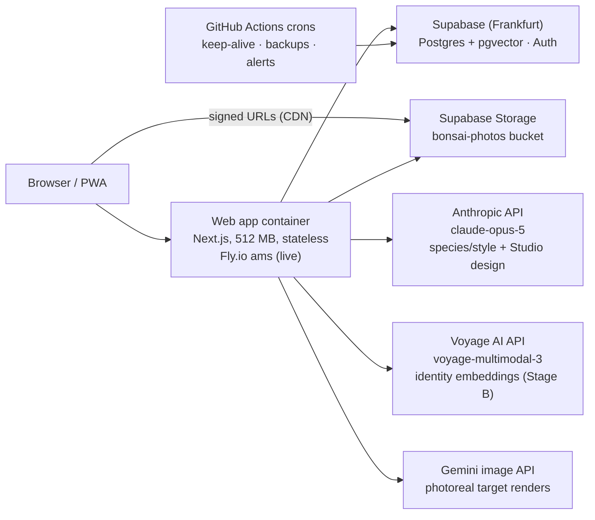

# Bonsai — Future-State Plan

Status: **Stage A complete and live in production at https://bonsai-progress.fly.dev** (Fly.io, ams; push-to-main auto-deploys). A1 (guardrails), A2 (Storage migration), A3 (container deploy), A4 (production smoke test **including the redeploy-persistence proof**) and C1 (Studio sweeper) are done and validated. Everything still open is owner-gated, not code-gated: an SMTP account (A1's last quarter), two backup secrets, `VOYAGE_API_KEY` (B1 gate → B2/B3), one restore-drill run (C2), and the key rotations.
Last updated: 2026-08-17
Companion docs: [architecture.md](architecture.md) (original recognition design), [DEPLOY.md](DEPLOY.md) (Fly deploy runbook), [GUARDRAILS.md](GUARDRAILS.md) (the four free-plan guardrails and their secrets), the review/implementation report artifact (claude.ai artifact "Bonsai — App Review & AI Roadmap").

This document is the single source of truth for where the product's infrastructure and AI architecture are going, why, and in what order. It captures the full plan agreed on 2026-08-16/17, including every constraint and correction surfaced during review.

---

## 1. Where we are today (validated baseline)

Everything below is implemented and CI-green, and was validated visually end-to-end (Playwright drives, screenshots reviewed) — in local mode and against the live Supabase project. The Stage A/C work described here is in the repository; §7 records what has shipped to production and what has not.

| Area | State |
|---|---|
| Core loops (capture → identify → confirm → timeline) | Working. The automatic identity match, photo serving, and full-catalog tree creation were all broken before 2026-08-15; all fixed and validated. |
| Persistence | One authoritative `CollectionStore` per deployment: `supabase` (Postgres, owner-scoped queries + RLS) or `local` (file-backed, zero dependencies). Selected via `BONSAI_DATA_BACKEND`. |
| Photo bytes | **In Supabase Storage** (`bonsai-photos`, keyed `<uid>/captures/…`, `<uid>/studio/…`) in supabase mode; still on disk in local mode, by design. Served as short-lived signed URLs through `/api/photos/*`. Stage A2 — done and validated. |
| Database | Hosted Supabase project `epqxygxvvlsobbyhhnke` (Frankfurt), migrations 0001–0006 applied. 244 species with pinned stable IDs, capture-submission wizard columns, `tree_target_states`, `allocate_tree_sequence()` RPC. Zero ID drift verified. |
| AI recognition | Claude (`claude-opus-5`, structured outputs, server-side fallbacks) suggests species + style per capture; falls back to the Python vision service's leaf index when Claude is unavailable or errors (fallback proven live during a billing outage). |
| AI Design Studio | Two-stage pipeline live: Claude designs (assessment, staged seasonal plan, constrained photo-edit instruction) → image provider renders (`gemini` implemented, `mock` for dev, `none`). Validated live end-to-end incl. persistence to `tree_target_states`. |
| Identity matching | Python vision service (FastAPI + DINOv2 CPU), per-embedding-model candidate scoring (legacy `pixel-rgb-16` embeddings coexist with `dinov2-base-pooler`). **Not deployed** — `VISION_SERVICE_URL` is unset in production, so automatic identity matching is off and users pick the tree manually; everything else degrades gracefully. |
| Deploy story | **Fly.io** — app `bonsai-progress` (ams, one 512 MB machine), `fly.toml` + a deploy Action on `main`. `render.yaml` deleted; `DEPLOY.md` and `.github/DEPLOYMENT.md` rewritten to the Fly shape. CI is a lint/build/test quality gate on `main`. |
| Guardrail crons | Keep-alive, nightly backup (`pg_dump` + bucket copy as a private artifact), storage watermark → GitHub issue, and a manual restore drill. `/api/health` reports app + database state. Secrets still owed for the backup job. |
| Robustness | Studio designs interrupted by a restart are swept to `failed` after 10 minutes with a "Design again" retry, instead of spinning forever (Stage C1 — done and validated). |
| PWA | Installable: icons, manifest, service worker (production-only registration), offline page. |

**Fixed costs today: ~$3/mo** (one Fly machine). Supabase is on the free plan; the vision service is not hosted.

Credentials note (2026-08-15/16): an Anthropic API key and a Supabase access token were shared in chat during setup. The token was single-purpose (migrations) and should be revoked; the API key should be rotated and lives only in gitignored `.env.local` / host env.

---

## 2. Target architecture (end state)

One managed backbone for all state, one tiny stateless container for compute, APIs for all ML.

### Component decisions and rationale

| Component | Decision | Why (and what was rejected) |
|---|---|---|
| Data, auth, files, vectors | **Supabase** (free now → Pro on triggers) | Already integrated and migrated; EU-resident next to nothing else to glue; auth-integrated RLS on both rows and storage objects; pgvector included. Rejected: Firebase (weak Postgres story), Neon+Clerk+R2 (three vendors of glue), AWS (ops overhead). Lock-in is moderate — Postgres/GoTrue/S3-compatible are all portable. |
| Web compute | **One always-on ~512 MB container** | Deliberately *not* serverless: Studio designs are 60–90 s in-process background jobs; serverless turns those into timeout gymnastics for zero benefit at this scale. Stateless after Stage A → host is a commodity, horizontally scalable later. |
| Identity embeddings | **Voyage `voyage-multimodal-3` API** (Stage B, gated) | Removes the only reason a 2 GB torch container exists. ~$0.0006/photo, first 150 B pixels free. **Gate:** must match DINOv2 re-ID quality side-by-side on real data before the Python service is retired. |
| Species/style + Studio design | **Claude `claude-opus-5`** (as shipped) | Vision + structured outputs + horticultural reasoning validated live. Server-side fallbacks enabled. Model tier is a cost lever the owner can pull later. |
| Photoreal renders | **Gemini image API** behind the provider interface | Identity-preserving photo *editing* (not text-to-image). `mock`/`none` fallbacks shipped. Unvalidated until a `GEMINI_API_KEY` exists. |
| Email | **Custom SMTP** (Resend/Brevo free tier) via Supabase auth | Supabase's default sender is limited to ~2 auth emails/hour — breaks onboarding on any plan. Custom SMTP is supported on the free plan and lifts the cap to a configurable 30+/hour. |

### Cost model

| Phase | Fixed / month | Marginal (per action) |
|---|---|---|
| **Early-adopter mode** (Supabase free + guardrails) | **~$3–5** (container only) | Capture with AI suggestions ~$0.05–0.15 · Studio design ~$0.15–0.30 · Gemini render ~$0.04 · Voyage embedding ~$0.0006 (free tier covers tens of thousands) |
| **Steady state** (Supabase Pro) | **~$28** ($25 Pro + ~$3 container) | same |

The marginal-cost shape maps directly onto the intended freemium model (free tier capped, Pro subscription + Studio credits) from the product report: fixed costs stay flat, paying users carry their own AI usage.

---

## 3. Stage A — Supabase Storage migration + stateless deploy

**Goal:** no photo byte ever depends on a container's disk again (in supabase mode); deploy the app as a stateless container with a live public URL.

### 3.1 Storage migration scope — **done**

The `bonsai-photos` bucket already existed (migration 0001) with owner-scoped RLS: objects must live under `<auth.uid()>/...` (first path folder = owner id). Everything below is implemented behind one façade, `apps/web/lib/photo-storage.ts`, which dispatches on the data backend so no caller knows which side it is writing to:

1. **Path convention** ✅ — storage keys are `<uid>/captures/<submissionId>-front.jpg`, `<uid>/captures/<submissionId>-leaf.png`, `<uid>/studio/<targetId>.<ext>`. The DB `storage_path` values keep their owner-free relative form (`captures/...`, `studio/...`); the storage layer prefixes the owner id. Verified against the live project: rows hold `captures/…`, objects are owner-prefixed.
2. **Uploads** ✅ — capture front/leaf writes and Studio render writes go through `supabase.storage.from("bonsai-photos").upload(...)` using the user's session, so RLS scopes every write.
3. **Serving** ✅ — `/api/photos/[...segments]` authenticates the viewer, then 307-redirects to a 1-hour signed URL; the redirect is cached for 30 minutes (always less than the signature's life). Supabase serves signed URLs with an `expires` header matching the signature, so a client re-fetches at most hourly — the `private, max-age=31536000, immutable` headers still apply to streamed responses, and objects are stored with a one-year cache lifetime. `BONSAI_PHOTO_SERVING=stream` is the documented fallback (same URLs, bytes proxied through the app); both modes were validated to return byte-identical images. The service worker never caches `/api/*`, so signed redirects and it do not interact at all.
4. **AI reads** ✅ — the Studio pipeline (Claude design input, Gemini render input, historical trajectory photos) downloads bytes from Storage. Capture-time Claude calls already worked from the in-memory upload, never from disk.
5. **Deletes** ✅ — `deleteTree` collects photo, leaf and Studio-render paths and calls `storage.remove()`; a Storage failure is logged, never surfaced as a failed delete. Validated: all three objects of a deleted tree disappeared from the bucket.
6. **One-time migration script** ✅ — `scripts/migrate-photos-to-storage.mjs`: uploads every disk file per user, verifies each upload by downloading it back and comparing sha256, skips objects already present with a matching hash, and never deletes anything on disk. `--dry-run`, `--user`, `--legacy-owner` flags. Runs with a service-role key, or with a single user's JWT (RLS-scoped) when the owner would rather not handle the service key. Proven against the live project: dry run → real run (3 files, hash-verified) → re-run (3 skipped).
7. **Local mode unaffected** ✅ — the local backend still writes and streams from `<repo>/data`; regression-tested with a full capture in local mode (bytes on disk, `200` streamed responses, no redirects).

> **Deploy-day note, and the last proof that this stage was needed.** Photos captured in production before this shipped lived on the Fly machine's ephemeral disk. An attempt to rescue the one such capture (a test tree from earlier the same day) through the live app returned **404 — the machine had already cycled and the bytes were gone**, while its database row survived. The orphaned test tree was deleted. For any future environment with photos on disk, run `scripts/migrate-photos-to-storage.mjs` *before* replacing the machine.

### 3.2 Hosting

- **Chosen and live: Fly.io**, `ams`, one machine `shared-cpu-1x` 512 MB (~$3.19/mo), no volume. `fly.toml` + `.github/workflows/fly-deploy.yml` on `main`. Its health check now points at `/api/health` (liveness only — that route answers 200/"degraded" when Postgres is unreachable so a Supabase blip cannot pull the machine out of rotation).
- **Rejected alternative: Hetzner CX22** (~€4.49/mo) with Docker Compose + Caddy (auto-TLS) + a deploy Action over SSH; also comfortably hosts the vision service during the Stage B transition, which Fly would price at ~$10.70/mo extra until retirement.
- Note: until Stage B completes, the Python vision service still needs somewhere to run (2 GB RAM). Options during the interim: Hetzner box (covers both cheaply), Fly 2 GB machine with auto-stop (cold start 1–2 min, capture degrades gracefully), or accept degraded identity matching (manual tree pick) in production until Stage B. **Current state: the vision service is not deployed and `VISION_SERVICE_URL` is unset in production, so capture degrades gracefully — Claude still suggests species and style, and the user picks the tree manually.**

### 3.3 Environment variables (production container)

| Var | Value |
|---|---|
| `BONSAI_DATA_BACKEND` | `supabase` |
| `NEXT_PUBLIC_SUPABASE_URL` / `NEXT_PUBLIC_SUPABASE_ANON_KEY` | from the project (re-check after any key rotation) |
| `ANTHROPIC_API_KEY` | rotated key |
| `BONSAI_IMAGE_PROVIDER` | `gemini` once `GEMINI_API_KEY` exists, else `none` |
| `GEMINI_API_KEY` | optional |
| `VISION_SERVICE_URL` | interim vision host URL, or unset (graceful degradation) |
| `VOYAGE_API_KEY` | Stage B |
| `BONSAI_PHOTO_SERVING` | unset (signed-URL redirects). `stream` proxies photo bytes through the app instead |
| `BONSAI_REPO_ROOT` | not needed in the container (marker discovery works); available as override |

Scripts-only credentials (never in the app container): `SUPABASE_SERVICE_ROLE_KEY` (migration + backup), `SUPABASE_DB_URL` (backup), `RESTORE_TARGET_DB_URL` (restore drill), `VOYAGE_API_KEY` (B1 benchmark). See [GUARDRAILS.md](GUARDRAILS.md).

### 3.4 Definition of done

**Validated already** (local app instance driving the *live* Supabase project, Playwright + screenshot review, 2026-08-17): sign-in, capture → live Claude suggestion → tree creation, photo served from the Storage CDN, Studio design + render persisted to Storage and rendered back, tree delete removing every object, and the statelessness proof in its strongest form — the app process was restarted **and** the user's on-disk photo directory renamed away, after which every collection thumbnail, tree photo and Studio render still loaded.

**A4 — passed in production** (2026-08-17, after the deploy): `/api/health` healthy, sign-in, capture → live Claude species suggestion → tree creation, the photo served through a Supabase signed URL, the capture landing in the bucket, and a Studio design reaching `ready` with its plan persisted (no render — production runs `BONSAI_IMAGE_PROVIDER=none`). Then the **redeploy-persistence proof**: a second deploy replaced the machine, after which every collection thumbnail, the pre-redeploy capture and the Studio design still loaded, still via signed Storage URLs, with no design left stuck in progress. Deleting the smoke-test tree removed its objects from the bucket. 9 + 5 + 4 checks, screenshots reviewed.

The one thing still owed here: **sign-up over custom SMTP**, which needs that account (§6).

---

## 4. Stage B — Voyage embeddings, vision service retirement

**Goal:** delete the 2 GB Python dependency from the architecture — after proving quality, not before.

### 4.1 The benchmark gate (blocking — script ready, needs `VOYAGE_API_KEY`)

`scripts/benchmark-voyage-reid.mjs` is written and waiting for the key. It scores both embedding spaces with the *same* ranking code (cosine over one gallery embedding per tree, the 55 catalog trees as distractors), prints a PASS/FAIL verdict, and exits 2 on a failed gate:
- Embed the reference catalog (~55 captured tree images) and all real capture photos with both DINOv2 (via the running vision service) and `voyage-multimodal-3`.
- Task: same-tree re-identification — for each duplicate/near-duplicate capture, does the true tree rank #1 (and within the current shortlist thresholds)?
- Also spot-check the leaf-species index path (217 leaf references) since Voyage would take that over too.
- **Cutover only if Voyage ≥ DINOv2 on top-1 and top-3.** Otherwise the Python service stays and this stage is shelved — the architecture still works, just at Hetzner-tier hosting cost.
- Two honest caveats the script prints itself: the 0.94 auto-match threshold is DINOv2-space-specific and would need recalibrating (it is reported, never compared), and the leaf spot-check scores the vision service with the query patch present in its own index — optimistic for DINOv2, i.e. conservative in the direction that matters.
- The re-ID set needs at least one tree with two or more photos. It is discovered from local-mode store documents by default; `--manifest` accepts your own labels.

### 4.2 Schema and code changes (post-gate — deliberately NOT implemented)

Nothing here is built: migration 0007 and the matching relocation are gated on 4.1 passing, and shipping a 1024-dim column plus a JS matcher before the gate would be exactly the kind of speculative work this plan was written to avoid.

- **Dimension mismatch (discovered in review):** existing columns are `vector(768)`; Voyage multimodal-3 outputs 1024-dim. Migration 0007 adds `embedding_v2 vector(1024)` (+ `embedding_model` already tracks provenance) on `photos` and `capture_submissions`; ivfflat index on the new column.
- Matching moves out of the Python service: JS cosine over the candidate set in the web app initially (collections are ≤ hundreds of photos), switching to a pgvector `<=>` query once collections warrant it. The per-embedding-model scoring already in `lib/` means old-space and new-space candidates coexist during transition; a re-embed script converges the backlog.
- Leaf-species suggestions: Voyage-embed the 217-entry leaf index once into a table; the Claude-unavailable fallback path queries it via pgvector instead of the Python endpoint.
- Retire: `services/vision` deployment (repo code can remain for the benchmark/leaf-review tooling), `VISION_SERVICE_URL`, the interim vision host, vision entries in deploy config.

---

## 5. Stage C — robustness + cleanup

1. **Studio stale-job sweeper** ✅ **done and validated.** On Studio data load *and* on every poll of `/api/studio/[targetId]`, any target in progress for more than 10 minutes that is not running in this process is marked `failed` with "This design was interrupted by a server restart. Design again to pick up from the current photos.", and the failed card carries a **Design again** button that re-runs the design with the original brief (and the previous plan's style/horizon when it got that far). Validated by planting a target stuck at `analyzing` 30 minutes old: the card replaced the spinner, the row flipped to `failed`, and the retry produced a new `ready` design that renders.
2. **Backups get restore-tested** — the drill is automated but **not yet run**: `.github/workflows/restore-drill.yml` restores the newest backup artifact into a throwaway `pgvector/pgvector:pg17` container and `scripts/restore-drill.mjs` asserts tables, the `allocate_tree_sequence()` RPC, 244 species with no ID drift, no orphaned photo rows, and every storage object matching its manifest hash. It needs one successful nightly backup first (which needs the two secrets in [GUARDRAILS.md](GUARDRAILS.md)).
3. Deploy-config cleanup ✅ **done** — `render.yaml` deleted, `DEPLOY.md` + `.github/DEPLOYMENT.md` + `README.md` rewritten to the Fly shape, `.env.example` extended, Dockerfile comment corrected (the `/app/data` directory is local-mode scratch space now, not a disk to mount). CI unchanged as the quality gate.
4. Key hygiene confirmation — **owner action, still open**: rotate the chat-exposed Anthropic key, revoke the Supabase access token, rotate the Fly deploy token. Checklist with commands in [GUARDRAILS.md](GUARDRAILS.md#key-hygiene).

---

## 6. Free tier now, Pro on triggers

**Decision: launch early-adopter mode on the Supabase free plan.** The pause risk that killed the project in summer 2026 was an artifact of zero traffic, not a plan property. Four guardrails (all free, all GitHub Actions) make free viable:

| Guardrail | Implementation | State |
|---|---|---|
| Keep-alive | `.github/workflows/keep-alive.yml`, daily 06:12 UTC: `GET /api/health` (which itself round-trips to Postgres and reports `database`) plus a direct REST `select` so the database sees traffic even if the container is down. Fails the run on either. | **done** — both steps executed successfully by hand; the health endpoint's `ok` / `degraded` / `?strict=1` 503 behaviour was verified against a reachable and an unreachable project |
| DIY backups | `.github/workflows/nightly-backup.yml`, daily 02:37 UTC: `pg_dump --format=custom --schema=public` + a full copy of the bucket with a sha256 manifest (`scripts/backup-storage-bucket.mjs`), uploaded as one private artifact (30-day retention). Supabase-managed `auth`/`storage` schemas are excluded on purpose — re-uploading photos recreates their metadata rows. | **code done, needs secrets** — `SUPABASE_DB_URL` + `SUPABASE_SERVICE_ROLE_KEY`. The job fails loudly until they exist, because a silent no-op backup is worse than a red run |
| Custom SMTP | Resend/Brevo free tier in Supabase auth settings (default sender = ~2 emails/hour, an onboarding-killer; custom SMTP → 30+/hour configurable) | **owner action** — step-by-step in [GUARDRAILS.md](GUARDRAILS.md) §3 |
| Storage watermark | Same nightly job measures the bucket and, past 800 MB (`STORAGE_WATERMARK_MB`), opens or comments on a GitHub issue titled "Storage watermark passed — plan the Supabase Pro upgrade" | **done** (rides on the backup job's secrets) |

**Free-plan ceilings to respect:** ~2,000–2,500 photos (1 GB at current ~400 KB client-side compression), 5 GB egress/month (~10k image views; immutable caching stretches this), 500 MB database (ample — embeddings are KBs), no managed backups (mitigated above).

**Upgrade to Pro ($25/mo: 100 GB storage, 250 GB egress, daily backups, no pausing) when any trigger fires:**
- storage > 800 MB, or
- egress consistently > 4 GB/month, or
- **first paying user** (cleanest: revenue buys it), or
- owner judgment that user data now exceeds what DIY backups should carry.

---

## 7. Execution order and effort

| Step | State | Blocked on |
|---|---|---|
| A1 Guardrail crons (keep-alive, backups, watermark) | **done** — three workflows + `/api/health` | backup job needs `SUPABASE_DB_URL` + `SUPABASE_SERVICE_ROLE_KEY` (owner) |
| A1b Custom SMTP | not started (dashboard-only work) | Resend/Brevo account (owner) |
| A2 Storage migration code + migration script | **done and validated** against the live project | — |
| A3 Container deploy + deploy Action | **done** — Fly app `bonsai-progress` (ams, 512 MB, single machine), `fly.toml`, deploy Action on `main`, `ANTHROPIC_API_KEY` secret set | — |
| A4 Production smoke test incl. redeploy-persistence proof | **done** — passed after the deploy, machine replaced and every photo still loaded | sign-up-over-SMTP leg waits on the SMTP account |
| B1 Voyage benchmark | **script ready** | `VOYAGE_API_KEY` (owner) |
| B2 Migration 0007 + matching relocation + re-embed + leaf index | intentionally not started | B1 gate passing |
| B3 Vision service retirement | intentionally not started | B2 validated |
| C1 Studio sweeper + retry | **done and validated** | — |
| C2 Restore drill, config cleanup, docs, key-hygiene check | config + docs + drill automation **done**; drill unrun | one successful nightly backup; owner key rotation |

Validation bar for every stage: the same as this whole effort — drive the real app, screenshot it, verify the rows/objects landed, never call it done on theory.

## Open decisions

1. ~~Container host~~ — **resolved: Fly.io**, live in `ams`. The vision service is not hosted anywhere; capture degrades gracefully until Stage B resolves it.
2. ~~Deploy Stage A2~~ — **shipped and verified in production** (commit "Ship Stage A of the future-state plan", CI and deploy green, A4 passed).
3. **Backup secrets** — `SUPABASE_DB_URL` and `SUPABASE_SERVICE_ROLE_KEY` as repository secrets; without them the nightly backup fails by design.
4. **SMTP provider account** (Resend or Brevo free tier) — the last quarter of A1, and the thing that currently caps sign-ups at ~2/hour.
5. **`GEMINI_API_KEY`** (optional, any time) — turns Studio renders photoreal; the provider interface and `mock`/`none` fallbacks are already shipped.
6. **`VOYAGE_API_KEY`** — needed to run B1, which gates all of Stage B.
7. Confirm the Anthropic key rotation, Supabase access-token revocation, and Fly token rotation happened ([checklist](GUARDRAILS.md#key-hygiene)).

## Deferred by design (tracked, not planned)

- Cloudflare R2 as an egress-cost lever if image traffic ever dominates Supabase egress.
- Multi-instance scaling, native app (both unlocked by the stateless container + same API).
- Product-feature roadmap (care engine, health diagnosis, journal, timelapse, billing) — lives in the review/roadmap artifact; infrastructure above is sized so none of it requires re-architecture.
